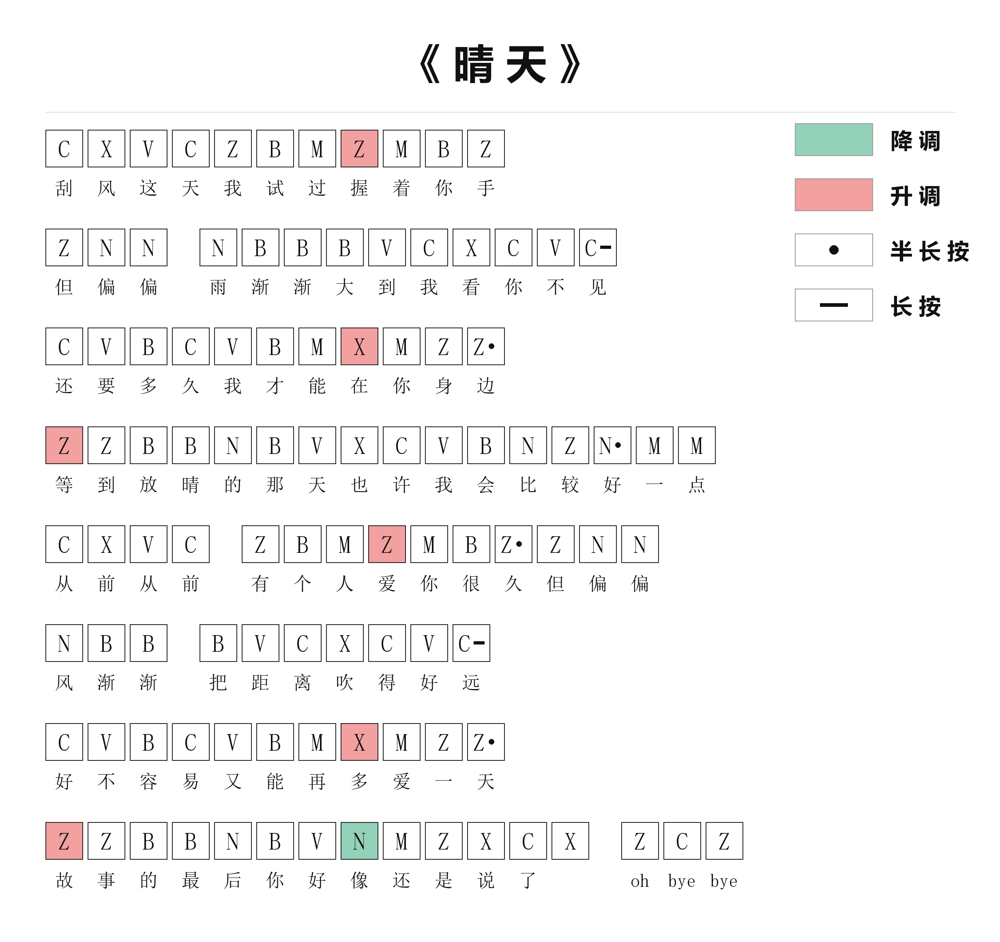

# 三角洲口琴谱生成器

把歌曲简谱转成《三角洲行动》「守夜人口琴」的键盘琴谱，并渲染成图片的 WorkBuddy Skill。

输入一张简谱（截图 / 文本都行），输出一张白底琴谱图：键盘字母装在方框里、歌词逐字对齐在方框下方，
**升调红底、降调绿底**，长按与半长按直接标在框内，右上角自带图例。



> 上图由 `examples/晴天.txt` 一跑生成，可以自己复现：`python scripts/render_score.py examples/晴天.txt -o out.png`

## 为什么需要它

《三角洲行动》S11 赛季的「守夜人口琴」不是按 do-re-mi 弹的，而是一排键盘键 + 三个鼠标修饰键。
网上的简谱全是数字，得先翻译成键位才能弹。这个 skill 干的就是这件事，顺便把歌词对齐排好版 ——
不然你只能对着两行数字来回数格子。

## 安装

把整个目录复制到 WorkBuddy 的用户级 skills 目录：

```bash
# Windows
xcopy /E /I delta-harmonica-score "%USERPROFILE%\.workbuddy\skills\delta-harmonica-score"

# macOS / Linux
cp -r delta-harmonica-score ~/.workbuddy/skills/
```

依赖只有一个 Pillow（渲染用）：

```bash
pip install pillow
```

字体不用管，脚本会自动在系统里找（Windows 用宋体 + 微软雅黑，macOS 用 Songti / PingFang，Linux 找 Noto CJK），
找不到会降级，不会报错中断。

## 用法

在 WorkBuddy 里直接说「把这张简谱转成三角洲口琴谱」并附上简谱图片即可。
也可以手写乐谱文件后自己跑脚本：

```bash
python scripts/render_score.py 歌曲.txt -o 歌曲-口琴谱.png --scale 2
```

参数：

| 参数 | 说明 |
|---|---|
| `-o` | 输出 PNG 路径 |
| `--scale` | 清晰度倍数，默认 2（约 2300px 宽），要更清晰用 3 |
| `--title` | 覆盖曲名 |

## 键位映射

**音级 → 键盘**：`1 2 3 4 5 6 7 1̇` → `Z X C V B N M ,`
（键盘上连续的一排，从左到右正好是 C 大调音阶）

**八度 → 修饰键 + 底色**：

| 简谱记号 | 游戏内操作 | 图上底色 |
|---|---|---|
| 中音（数字无点） | 直接按键 | 白底黑字 |
| 高音（数字上方一点） | 按住鼠标**右**键（+12 半音） | **红底** |
| 低音（数字下方一点） | 按住鼠标**左**键（−12 半音） | **绿底** |
| 升/降号 `#` `b` | 按住鼠标**中**键（+1 半音） | 黄底（用到才出现图例） |

**时长**：`3-` 长按（框内短横）、`3·` 半长按（框内圆点）。

映射依据游戏内实测复现的乐器数据：8 个音级键的半音偏移为 `0/2/4/5/7/9/11/12`，
左键整体 −12、右键整体 +12、中键整体 +1，左右互斥且中键可叠加，因此这件乐器是完全半音阶的。

## 乐谱文件格式

一个乐句一行，音符和歌词用 `|` 分开，歌词与音符 **严格 1:1**，没有歌词的音符写 `-`：

```
# 歌名
// # 开头是曲名，// 是注释，空行忽略
// 记号： ^1 高音  _6 低音  #4 升半音  b7 降半音  3- 长按  1· 半长按  0 休止
// 音符行里的 / 表示换气间隔，只影响排版

3 2 4 3 1 5 7 ^1 7 5 1 | 刮 风 这 天 我 试 过 握 着 你 手
1 6 6 / 6 5 5 5 4 3 2 3 4 3- | 但 偏 偏 雨 渐 渐 大 到 我 看 你 不 见
```

长乐句会自动折行。音符数对不上歌词数时脚本会直接报错并指出行号，不会带病出图。

## 目录结构

```
delta-harmonica-score/
├── SKILL.md                    # skill 定义：触发条件、映射规则、工作流、交付自检清单
├── scripts/
│   └── render_score.py         # 渲染器（Pillow，无网络依赖）
├── references/
│   ├── mapping.md              # 全量键位／音域表，含超出音域怎么降级
│   └── jianpu.md               # 读简谱时最容易漏的记号：八度点、延音线、反复号、一字多音
└── examples/
    ├── 晴天.txt                # 可跑的样例谱源
    └── demo-晴天.png           # 样例输出
```

## 已知边界

- 只处理**单声部旋律**，和声与多声部需要先指明取哪一声部。
- 音域：中音 / 高音 / 低音各一组是稳妥范围。倍低音按不出来；倍高音只有 `^^1`（右键 + 逗号）可达。
- 半音（中键）操作别扭，偶尔出现没问题，整首歌大面积半音建议提醒演奏者。
- 快歌里密集的十六分音符对普通人不友好，密集段建议只保留主旋律骨干音。
- 八度的判断依赖简谱上那个小点。如果是低清截图，建议再找一份逐字对齐的谱源交叉核对 —— 漏一个点就错一个音。

## License

MIT
